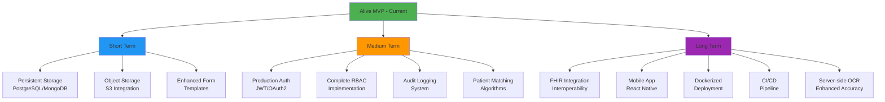

# Alive

A web-first healthcare solution that empowers patients and increases healthcare practice accountability through intelligent paper form digitization.

## Overview

Alive is a proof-of-concept application that enables browser-based optical character recognition (OCR) for paper form digitization. The project features a React frontend with Google GenAI for client-side text extraction and a minimal Express backend, delivering a seamless experience that puts healthcare data directly in patients' hands.

## Tech Stack

### Frontend
- **React** 19.2.2 + **React DOM** 19.2.2
- **Vite** 7.2.7 (build tool)
- **TypeScript**
- **React Router DOM** 7.10.1
- **@google/genai** (client-side OCR)
- **Lucide React** (icons)
- **React Markdown**

### Backend
- **Node.js** + **Express** 4.19.2
- **CORS**, **body-parser**, **dotenv**
- **Nodemon** (development)

### Deployment
- **Vercel** (frontend hosting)

## Repository Structure

```
/                           # Root frontend (Vite + React + TypeScript)
├── App.tsx
├── index.tsx
├── index.html
├── vite.config.ts
├── tsconfig.json
├── types.ts
├── package.json
├── components/
├── contexts/
└── services/

/Alive-3--main              # Legacy frontend snapshot

/backend                    # Express backend
├── server.js
└── package.json
```

## Getting Started

### Prerequisites
- Node.js (v16+ recommended)
- npm or yarn

### Frontend Setup

```bash
# Install dependencies
npm install

# Run development server
npm run dev

# Build for production
npm run build

# Preview production build
npm run preview
```

### Backend Setup

```bash
# Navigate to backend directory
cd backend

# Install dependencies
npm install

# Create .env file with required variables
cat > .env << EOF
PORT=3000
EOF

# Run development server (with nodemon)
npm run dev

# Or run production server
npm start
```

### Deploy to Vercel

```bash
# Install Vercel CLI
npm i -g vercel

# Deploy
vercel
```

### Legacy Frontend (Alive-3--main)

```bash
cd Alive-3--main
npm install
npm run dev
```

## Features

### Implemented ✅
- **Client-side OCR**: Browser-based text extraction using Google GenAI
- **Web UI**: React-based interface with routing and form components
- **Image Upload/Capture**: Support for uploading or capturing paper form images
- **Text Extraction**: Automatic parsing of form fields from images
- **Editable Fields**: Manual correction of extracted text
- **REST API**: Basic Express endpoints for demo functionality
- **Vercel Deployment**: One-click deployment to production
- **Role-Based Access Control (RBAC)**: ⚙️ In progress

### Not Implemented (Future Work) ⚠️
- Mobile React Native application
- Database integration (PostgreSQL/MongoDB)
- Object storage (S3/cloud storage)
- Production authentication (JWT/OAuth2)
- FHIR adapters or healthcare interoperability
- Docker/Kubernetes deployment configs
- CI/CD pipeline
- Persistent data storage
- Patient matching algorithms

## Quick Demo

1. **Start the application**
   ```bash
   # Terminal 1 - Frontend
   npm run dev
   
   # Terminal 2 - Backend
   cd backend
   npm run dev
   ```

2. **Test OCR functionality**
   - Navigate to the scan/upload page
   - Upload an image of a paper form
   - Watch Google GenAI extract text in real-time
   - Edit extracted fields as needed

3. **Experience the impact**
   - See how patients can digitize their medical records instantly
   - Observe the accountability layer for healthcare practices

## Development

### Available Scripts

**Frontend:**
- `npm run dev` - Start Vite dev server
- `npm run build` - Build for production
- `npm run preview` - Preview production build

**Backend:**
- `npm run dev` - Start with nodemon (auto-reload)
- `npm start` - Start production server

## Roadmap



## Post-Hackathon Plans

Our vision extends beyond the MVP to create a comprehensive healthcare data empowerment platform:

1. **Infrastructure Enhancement**
   - Migrate to cloud-native architecture with PostgreSQL and S3
   - Implement horizontal scaling for high-volume processing
   - Add Redis caching layer for performance optimization

2. **Security & Compliance**
   - Complete RBAC implementation with granular permissions
   - Achieve HIPAA compliance certification
   - Implement end-to-end encryption for all patient data
   - Add comprehensive audit logging and monitoring

3. **Feature Expansion**
   - Build native mobile applications (iOS/Android)
   - Integrate with major EHR systems via FHIR
   - Add AI-powered form recognition and auto-classification
   - Implement patient consent management workflows

4. **Enterprise Readiness**
   - Multi-tenant architecture for healthcare providers
   - White-label solutions for clinic networks
   - Advanced analytics and reporting dashboards
   - API marketplace for third-party integrations

## Technical Considerations

### Architecture Philosophy
- **Patient-First Design**: Every feature prioritizes patient autonomy and data ownership
- **Progressive Enhancement**: Core functionality works offline, enhanced features online
- **Privacy by Design**: Data minimization and encryption at every layer
- **Accessibility**: WCAG 2.1 AA compliance for inclusive healthcare access

### Performance Optimization
- Client-side OCR reduces server costs and increases privacy
- Lazy loading and code splitting for faster initial load
- Progressive Web App (PWA) capabilities for offline use
- Optimistic UI updates for responsive user experience

## License
ICON CORPORATION LIMITED

## Contact

**Project Lead:** IPINNIMO OLUWAFEMI

---

**Built with ❤️ to empower patients and transform healthcare accountability**
